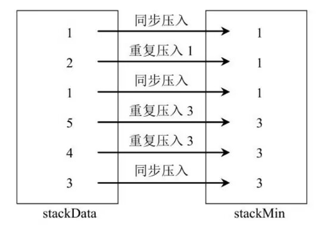
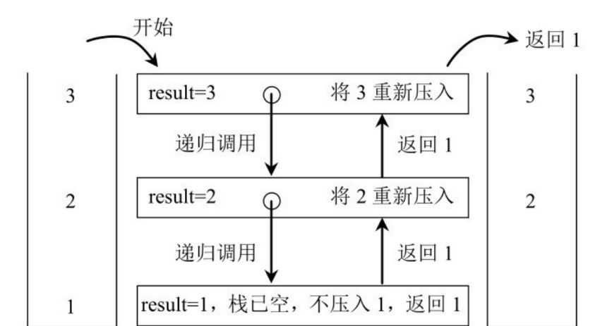
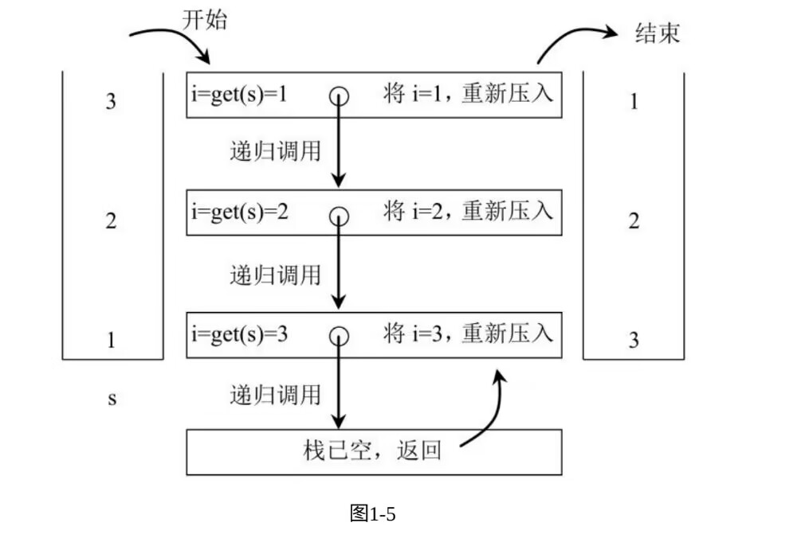

## 1. 设计一个又getMIn功能的栈
实现一个特殊的栈，在实现栈的基本功能的基础上，在实现返回栈中最小元素的操作。

***解题思路***: 感觉有动态规划的味道，就是你要注意到每一步栈出栈入的最小值，所以这里额外使用了一个栈stackMin。


```java
import java.util.Stack;

public class GetMinStack {
    private Stack<Integer> stackData;
    private Stack<Integer> stackMin;

    public GetMinStack() {
        this.stackData = new Stack<Integer>();
        this.stackMin = new Stack<Integer>();
    }

    public int Getmin() {
        if (this.stackMin.isEmpty()) {
            throw new RuntimeException("Your stack is empty");
        }
        int min = stackMin.peek();
        return min;
    }

    public void push(int num) {
        stackData.push(num);
        if(stackMin.empty()) {
            stackMin.push(num);
        } else if(this.Getmin() >= num) {
            stackMin.push(num);
        } else {
            stackMin.push(this.Getmin());
        }
    }

    public int pop(int num) {
        int value = -1;
        if (stackData.empty()) {
            throw new RuntimeException("Your stack is empty");
        } else {
            value = stackData.pop();
            stackMin.pop();
        }
        return value;
    }
}

```

## 2. 由两个栈组成的队列
编写一个类，用两个栈实现队列，支持队列的基本操作（add、poll、peek）
```java
import java.util.Stack;

public class TwoStack_to_Queue {
    private Stack<Integer> stackpush;
    private Stack<Integer> stackpop;

    public TwoStack_to_Queue() {
        stackpush = new Stack<Integer>();
        stackpop = new Stack<Integer>();
    }

    public void add(int num) {
        stackpush.push(num);
    }

    public int poll() {
        if (stackpush.empty() && stackpop.empty()) {
            throw new RuntimeException("Your queue is empty");
        }
        else if (stackpop.empty()) {
            while (!stackpush.empty()) {
                stackpop.push(stackpush.pop());
            }
        }
        return stackpop.pop();
    }

    public int peek() {
        if (stackpush.empty() && stackpop.empty()) {
            throw new RuntimeException("Your queue is empty");
        }
        else if (stackpop.empty()) {
            while (!stackpush.empty()) {
                stackpop.push(stackpush.pop());
            }
        }
        return stackpop.peek();
    }
}

```

## 如何仅用递归函数和栈操作逆序一个栈
一个栈以此亚茹1、2、3、4、5，那么从栈顶到栈底分别为5、4 、3 、2 、1.将这个栈转置后，从栈顶到栈底为1，2,3,4,5 ，也就是实现栈中元素的逆序，但是只能用递归函数来实现，不能用其他数据结构。

***解题思路*** 前面两道题基本都算是没做出来，但是看题解可以恍然大悟，这道题对于我来说还是有点难度。
第一个函数获得并且删除栈中的最底层的元素：

第二个函数将获取的最底层的元素压入栈中，但由于递归，所以最开始获取的最底层元素反而是栈顶元素。（兄弟，你知道我要说什么，笑~）



```java
import java.util.Stack;

public class ReverseStack {
    public static int getAndRemoveLastElement(Stack<Integer> stack) {
        int result = stack.pop();
        if (stack.isEmpty()) {
            return result;
        } else {
            int last = getAndRemoveLastElement(stack);
            stack.push(result);
            return last;
        }
    }
    public static void reverse(Stack<Integer> stack) {
        if (stack.isEmpty()) {
            return;
        }
        int i = getAndRemoveLastElement(stack);
        reverse(stack);
        stack.push(i);
    }
}
a
```