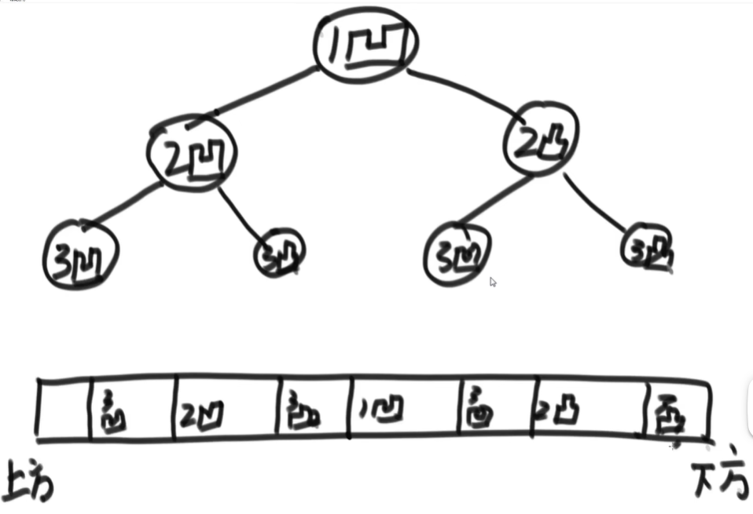
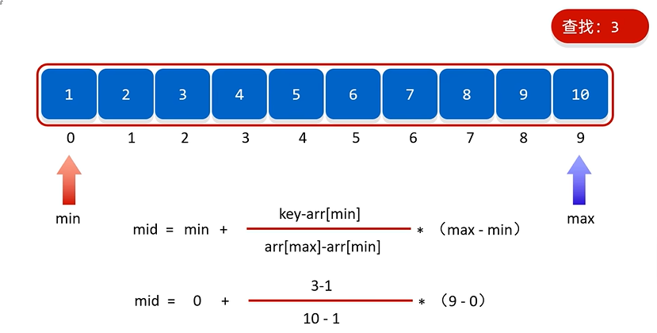

## 二分法
二分法经常用来解决的问题：
1. 在一个有序数组中找一个数是否存在。
2. 在一个有序数组中，找一个>=某个数最左侧的位置。
3. 局部最小值问题：**不一定需要有序才可以用二分**
   给定一个无序的arr数组，相邻的数一定不相等，找局部最小；

举例，一个长度为N的数组
则若arr[0] < arr[1] 则 arr[0] 为局部最小值
若 arr[N - 2] > arr[N - 1] 则 arr[N - 1] 为局部最小值
若 arr[i - 1] > arr[i] < arr[i + 1] 
则arr[i] 为局部最小。

要求：时间复杂度小于O(N);

**题解** 
```java
如果arr[0] > arr[1] 并且 arr[N - 2] < arr[N - 1]
那么说明在arr[0] 和 arr[N - 1]之间必定存在一个拐点。
```

```java
同理，我们可以随机取一个中间点arr[M], 如果arr[M]不满足这个条件，则拐点必定存在于0 - M或者 M - N - 1之间。
```

### 二分查找的改进版本
#### 插值查找
如果当前数据有效并且分布的比较均匀，则：

可以大致知道数字应该在哪一个位置，然后来做查找


