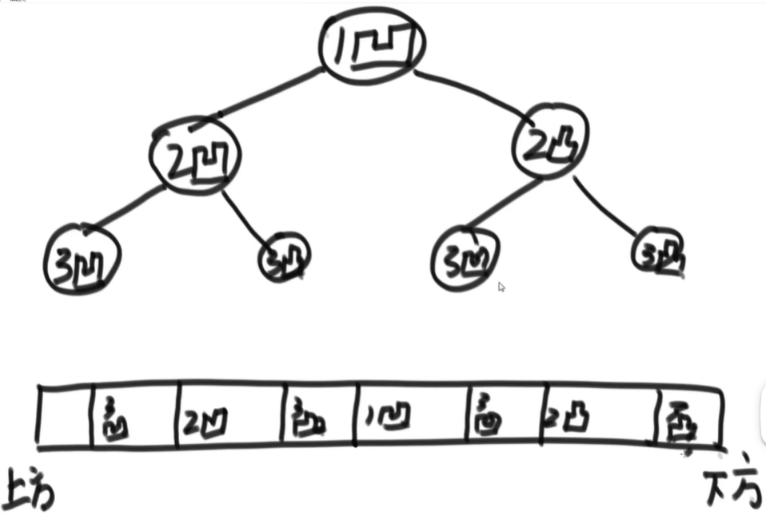

## 二叉树

首先定义二叉树的结构:
```java
class Node<V>{
  V value;
  Node left;
  Node right;
}
```

用递归和非递归两种方式实现二叉树的先序、中序、后序遍历
如何直观的打印一棵二叉树
如何完成二叉树的宽度优先遍历（常见题目：求一棵二叉树的宽度）


### 二叉树的相关概念及其实现判断
1. 如何判断一棵二叉树是否是搜索二叉树
   即满足：左子树是搜索二叉树，右子树也是搜索二叉树。左子树的节点最大值要小于当前节点，右子树的最小值要大于当前节点。
   <br>
2. 如何判断一棵二叉树是完全二叉树
   <br>
   
3. 如何判断一棵二叉树是否是满二叉树
   <br>
   
4. 如何判断一棵二叉树是否是平衡树（二叉树题目套路）
   即满足左子树是平衡二叉树，右子树也是平衡二叉树，|左子树的高度减去右子树的高度|<=1
   <br>

5. 给定两个二叉树的节点node1和node2，找到他们的最低公共祖先节点。
   <br>

6. 在二叉树中找到一个节点的后继节点
   现在有一个新的二叉树节点类型如下：
```java
publi class Node {
  public int value;
  public Node left;
  public Node right;
  public Node parent;
  public Node(int val) {
    value = val;
  }
}
```
该结构比普通二叉树节点结构多了一个指向父节点parent指针。
假设有一颗Node类型的节点组成的二叉树，树中每个节点的parent指针都正确的指向自己的父节点，头结点的parent指向null。
只给一个在二叉树中的某个节点node，请实现返回node的后继节点的函数。在二叉树的中序遍历的序列中，node的下一个节点叫做node的后继节点。

<br>
7. 二叉树的序列化和反序列化

内存里的一棵树如何变成字符串形式，又如何从字符串形式变成内存里的数，如何判断一棵二叉树是不是另外一棵二叉树的子树？

<br>
8. 把一段纸条竖着放在桌子上，然后从纸条的下边向上方对折1次，压出折痕后展开。
   此时折痕是凹下去的，即折痕突起的方向指向纸条的背面。如果从纸条的下边向上方连续对折2次，压出折痕后展开，此时有三条折痕，从上到下依次是下折痕、下折痕和上折痕。
   给定一个输入参数N，代表纸条都从下边向上方连续对折N次。请从上到下打印所有折痕的方向。
   例如：N = 1时，打印: down N = 2， N = 2时，打印 down down up
   
  
  有图片可知，折纸的痕迹顺序实际上就是一棵树的中序遍历


### 方法论
 在面试里面很好,往往二叉树最难的题目就是涉及到使用**树型DP**
如果可以通过左子树和右子树传递的信息来解决问题，就可以使用套路。
