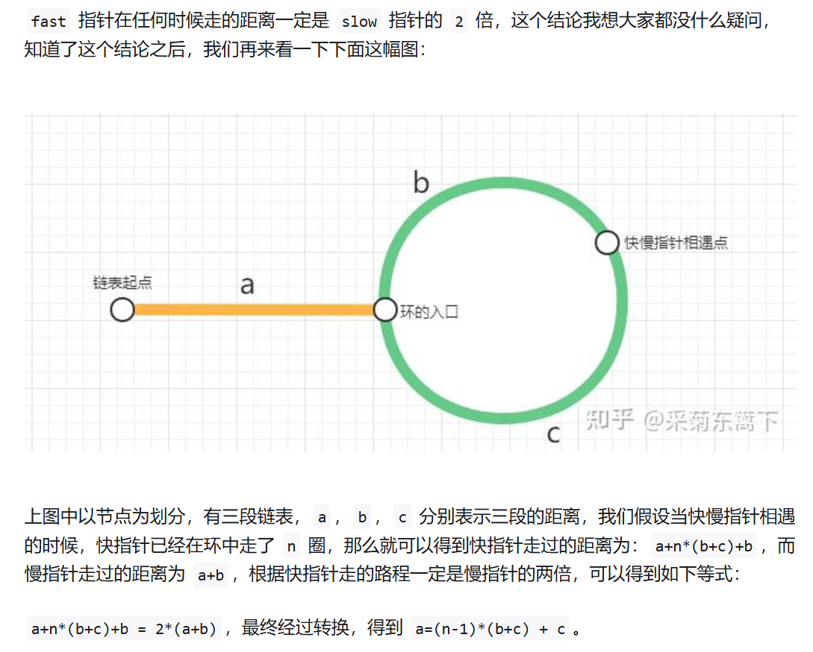

## 链表
单链表的节点结构
```java
class Node<V> {
  V value;
  Node next;
}
```
<br>
双链表的节点结构

```java
class Node<V> {
  V value;
  Node next;
  Node last;
}
```

### 例题：
1. 分别实现反转单向链表和反转双向链表的函数
   要求：如果链表长度为N，时间复杂度要求为O(N),额外空间复杂度要求为O(1)
  
- 反转单链表
```java
public Node static reverseSingleLinklist(Node head) {
  if (head == null || head.next == nul) {
    return head;
  } 
  Node p = head.next;
  Node last = head;
  last.next = null;

  while (p != null) {
    Node tmp = p.next;
    p.next = last;
    last = p;
    p = tmp;
  }
  return last;
}
```
- 反转双链表
```java
public Node static reverseDoubleLinklist(Node head) {
  if (head == null || head.next == null) {
    return head;
  }

  Node p = head;

  while (p.next != null) {
    node tmp = p.next;
    p.next = p.last;
    p.last = tmp;
    p = tmp;
  }
  p.next = p.last;
  p.last = null;

  return p;

}
```

2. 打印两个有序链表的公共部分
   给定两个有序链表的头指针head1 和head2,打印两个链表的公共部分。
   要求：如果两个链表的长度之和为N，时间复杂度要求为O(N),额外空间复杂度为O(1)；

```java
public static void printCommonPart(Node n1, Node n2) {
  while (n1 != null && n2 != null) {
    if (n1.value == n2.value) {
      System.out.println(n1.value + " ");
    } else if (n1. value < v2.value) {
      n1 = n1.next;
    } else {
      n2 = n2.next;
    }
  }
}
```
3. 判断一个链表是否为回文结构
   给定一个单链表头结点，请判断该链表是否为回文结构。
   例如：1,2,3返回true
   1,2,2,1返回true
   1,2,3返回false

   如果链表长度为N，时间复杂度达到O(N) ，额外空间复杂度达到O(1)。

<br>

4. 将单向链表按某值划分为左边小，中间相等、又变大的形式
   给定一个单链表的头结点head，节点的值类型是整型，再给定一个整数pivot。实现一个调整链表的函数，将链表调整为左部分都是值小于pivot的节点，中间部分都是值等于pivot的节点，有部分都是值大于pivot的节点。
**[进阶]：再实现原问题功能的基础上做如下修改：**
- 调整后所有小于pivot的节点之间的相对顺序和调整前的一样
- 调整后所有等于pivot的节点之间的相对顺序和调整前一样
- 调整后所有大于pivot的节点之间的相对顺序和调整前一样
- 时间复杂度请达到O(N)，额外空间复杂度请达到O(1)

<br>


5. 复制含有随机指针节点的链表
   一种特殊的单链表节点类描述如下
   class Node {
    int value;
    Node next;
    Node rand;
    Node (int val) {
      value = val;
    }
   }
   rand指针式单链表节点结构中新增的指针，rand可能指向链表中的任意一个节点，也可能指向null。给定一个由Node节点类型组成的无环单链表的头结点head，请实现一个函数完成这个链表的复制，并返回复制的新链表的头结点。

<br>


6. 两个单链表相交的一系列问题
   给定两个可能有环也可能无环的单链表，头结点head1和head2。请实现一个函数，如果两个链表相交，请返回相交的第一个节点。如果不相交，返回null

   [要求]：如果两个链表长度之和为N，时间复杂度达到O(N)，额外空间复杂度请达到O(1)； 

### 方法论
1. 对于笔试，不用太在乎空间复杂度，一切为了时间复杂度
2. 对于面试，时间复杂度依然放在第一位，但是一定要找到空间最省的方法
3. 链表问题最难的地方在于边界问题


**重要技巧**:
1. 额外数据结构记录（哈希表等）
2. 快慢指针
   快指针一次走两步
   慢指针一次走两步
   - 对于无环的情况。当快指针走完的时候，慢指针刚好走到**中点**
   - 对于有环的情况。**快慢指针可以解决链表是否有环的问题**。
      其次，当快指针与慢指针相遇的时候，快指针**回到起点并且变成一次走一步**，慢指针原地
      重新开始遍历，**那么快指针与慢指针将在入环口相遇**。

      **原理**可以看这个链接：https://zhuanlan.zhihu.com/p/454449703
      
